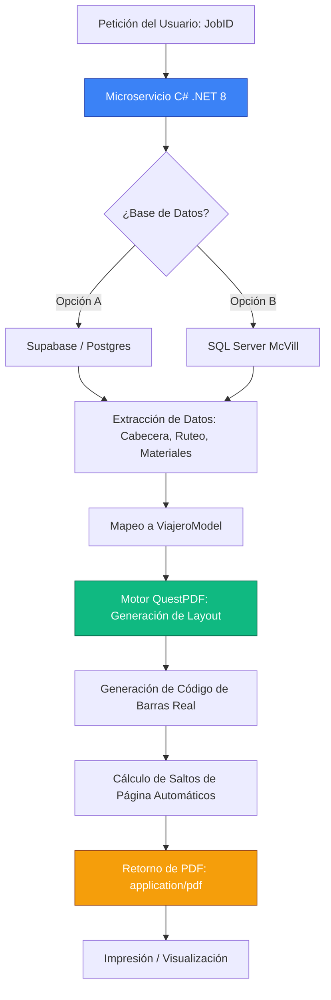

# 📑 Guía Maestra: Sistema de Reportes Industriales McVill

Esta guía documenta la arquitectura de microservicios desarrollada para la generación automatizada de **Viajeros de Producción** de alta fidelidad, utilizando un stack moderno, resiliente y escalable.

---

## 🏗️ 1. Arquitectura del Sistema

El sistema opera como un microservicio independiente en **.NET 8**, diseñado bajo el principio de **Single Responsibility**. 

### Mapa de Flujo del Proceso:


### El Stack Tecnológico:
*   **Lenguaje**: C# (La opción más limpia para lógica de negocios pesada).
*   **Motor de PDF**: **QuestPDF** (Basado en Layout fluido, no en HTML-to-PDF, lo que lo hace 10 veces más rápido y preciso).
*   **Base de Datos**: **Supabase (PostgreSQL)** con acceso directo vía **Npgsql**.
*   **Infraestructura**: Desplegable en cualquier servidor Windows/Linux o como contenedor Docker.

---

## 🧠 2. El "Cerebro" de Datos (Supabase)

Para replicar este sistema, se deben crear las siguientes tablas en el esquema `public`. Esta estructura permite manejar reportes de cientos de páginas con miles de operaciones.

### Tablas y Campos Clave:

#### `public.viajeros` (Cabecera)
| Campo | Tipo | Descripción |
| :--- | :--- | :--- |
| `id` | `text` (PK) | El Job ID (ej: 40166327.C760) |
| `cliente` | `text` | Nombre del cliente |
| `numero_parte` | `text` | Identificador único de la pieza |
| `cantidad_orden` | `numeric` | Total de piezas a fabricar |
| `descripcion` | `text` | Descripción técnica |

#### `public.viajero_operaciones` (Ruteo Técnico)
| Campo | Tipo | Descripción |
| :--- | :--- | :--- |
| `viajero_id` | `text` (FK) | Relación con el Job |
| `orden` | `integer` | Secuencia (10, 20, 30...) |
| `clave_operacion` | `text` | Código de la operación |
| `centro_trabajo` | `text` | Máquina o área (ej: LASER-01) |
| `tiempo_estimado` | `numeric` | Horas estimadas |

---

## 🎨 3. El "Arquitecto" (QuestPDF)

La potencia de este reporte reside en `ViajeroDocument.cs`. A diferencia de los reportes tradicionales, aquí se "dibuja" el documento usando código fluido.

**¿Por qué C# es la opción más limpia?**
Permite tipado fuerte. Si la base de datos cambia un campo, el compilador te avisa. Además, manejar el **PageBreak()** (salto de página automático) para insertar las hojas de Calidad y Herramental es trivial en C#.

```csharp
// Ejemplo de lógica de construcción en QuestPDF
public void Compose(IDocumentContainer container) {
    container.Page(page => {
        page.Header().Element(ComposeHeader);
        page.Content().Element(ComposeContent);
        page.Footer().Text(x => x.CurrentPageNumber());
    });
}
```

---

## 🔄 4. Manual de Migración a SQL Server (McVill On-Premise)

Si el equipo de sistemas de McVill desea utilizar su **SQL Server** interno en lugar de Supabase, solo deben seguir estos 3 pasos:

### Paso A: Cambiar el Driver
En el proyecto, desinstalar `Npgsql` e instalar el cliente oficial de Microsoft:
```bash
dotnet add package Microsoft.Data.SqlClient
```

### Paso B: Actualizar `DatabaseService.cs`
Sustituir las clases de conexión. La lógica de mapeo que implementamos por **Nombre de Columna** (no por índice) hace que la transición sea casi transparente.

```csharp
// Antes (Postgres/Supabase)
using Npgsql;
using var connection = new NpgsqlConnection(connString);

// Después (SQL Server)
using Microsoft.Data.SqlClient;
using var connection = new SqlConnection(connString);
```

### Paso C: Cadena de Conexión
Actualizar el `appsettings.json` con la ruta del servidor local de McVill:
```json
"ConnectionStrings": {
  "DefaultConnection": "Server=SQLEXPRESS;Database=McVillDB;Trusted_Connection=True;TrustServerCertificate=True;"
}
```

---

## 🚀 5. Instrucciones de Ejecución

1.  **Levantar el Servicio**: 
    Ejecutar `reporting-service.exe` o usar `dotnet run`. El servicio escuchará en el puerto `5005`.
2.  **Generar Reporte**:
    Realizar una petición GET a la URL:
    `http://localhost:5005/api/reports/viajero/{JobID}`
3.  **Resultado**:
    El microservicio procesará el ruteo, los materiales, las inspecciones de calidad y el herramental, devolviendo un chorro de bytes (PDF) listo para imprimir.

---

> [!IMPORTANT]
> **Tip de Robustez**: El sistema incluye lógica de conversión segura `Convert.ToDouble()`. Esto previene que el reporte falle si algún dato numérico viene como texto o nulo desde la base de datos de producción.

Este sistema es la base para el **IA.AGUS Ecosystem**, garantizando que McVill tenga reportes de nivel mundial con tecnología de punta. 🦾🔥
