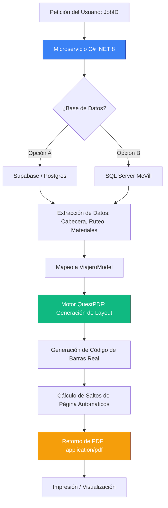

# 🚀 McVill Reporting Service - Guía Maestra de Integración y Reportes

Este documento es la **fuente única de verdad** para el motor de generación de reportes industriales de McVill. Diseñado bajo el estándar **IA.AGUS**, este sistema garantiza fidelidad industrial, estética premium y una arquitectura escalable.

---

## 🏗️ 1. Arquitectura del Sistema

El sistema opera como un microservicio independiente en **.NET 8**, optimizado para manejar ruteos técnicos complejos y materiales con alta precisión.

### Mapa de Flujo


---

## 🧩 2. Componentes del Software

1.  **`ViajeroModel.cs` (El Contrato)**: Define la estructura de datos que el reporte necesita.
2.  **`ViajeroDocument.cs` (El Motor de Diseño)**: Utiliza **QuestPDF** para "dibujar" el reporte. No es un convertidor HTML; es un motor de layout fluido que garantiza que las tablas no se corten mal y que los logotipos mantengan su calidad.
3.  **`ViajeroService.cs` (El Puente)**: Gestiona la comunicación con la DB. Implementa lógica de resiliencia para manejar datos numéricos que Supabase entrega como texto.

---

## 🧠 3. Estructura de Base de Datos (Supabase)

Para el funcionamiento del reporte, la base de datos debe cumplir con el siguiente esquema en el esquema `public`.

Estos son los campos necesarios para cargar información técnica de viajeros a Supabase. Utiliza estos nombres de columna exactos en tus archivos CSV o Excel.

---

## 1. Cabecera (`viajeros`)
| Columna | Tipo | Requerido | Descripción |
| :--- | :--- | :--- | :--- |
| **id** | Texto | SÍ | ID del Job (ej: 40124710.01) |
| **cliente** | Texto | SÍ | Nombre del cliente |
| **numero_parte** | Texto | SÍ | ID de la pieza |
| **descripcion** | Texto | NO | Descripción técnica |
| **cantidad_orden** | Numérico | SÍ | Cantidad total |
| **es_maestro** | Boolean | NO | `true` para los 20 registros premium |

---

## 2. Operaciones (`viajero_operaciones`)
| Columna | Tipo | Requerido | Descripción |
| :--- | :--- | :--- | :--- |
| **viajero_id** | Texto | SÍ | Debe coincidir con el ID de cabecera |
| **orden** | Entero | SÍ | Secuencia (10, 20, 30...) |
| **clave_operacion**| Texto | NO | Código de operación |
| **nombre_operacion**| Texto | SÍ | Nombre descriptivo |
| **centro_trabajo** | Texto | NO | Máquina o área |
| **descripcion_detallada**| Texto | NO | Instrucciones completas |
| **tiempo_estimado** | Numérico | NO | Horas hombre/máquina |

---

## 3. Materiales (`viajero_materiales`)
| Columna | Tipo | Requerido | Descripción |
| :--- | :--- | :--- | :--- |
| **viajero_id** | Texto | SÍ | Relación con el Job |
| **clave** | Texto | NO | SKU del material |
| **descripcion** | Texto | SÍ | Nombre del material |
| **cantidad** | Numérico | SÍ | Cantidad necesaria |
| **unidad** | Texto | NO | pz, kg, m, etc. |

---

## 4. Componentes (`viajero_componentes`)
| Columna | Tipo | Requerido | Descripción |
| :--- | :--- | :--- | :--- |
| **viajero_id** | Texto | SÍ | ID del viajero padre |
| **parte** | Texto | SÍ | No. de parte del componente |
| **descripcion** | Texto | SÍ | Nombre del componente |
| **cantidad** | Numérico | SÍ | Cantidad por ensamble |

---

### 💡 Notas Técnicas
1. **Tipos Numéricos**: Usar punto `.` para decimales. No usar comas `,`.
2. **Booleans**: Usar `true` o `false` (en minúsculas).
3. **IDs**: Asegurar que los IDs no tengan espacios en blanco al inicio o final.

---

## 🏆 4. Estrategia de "Viajeros Maestros"

Para garantizar la calidad del reporte durante la fase de desarrollo, hemos implementado el concepto de **Viajeros Maestros**.

- **Objetivo**: Trabajar con 20 registros perfectamente completados (con todas las operaciones, materiales y componentes detallados).
- **Identificación**: Filtrar en la base de datos por `es_maestro = true`.
- **Uso**: El servicio de impresión masiva prioriza estos registros para demostraciones de "WOW Factor".

---

## 🛠️ 5. Configuración y Ejecución

### Requisitos
- .NET 8 SDK instalado.
- Puerto **5005** disponible.

### Ejecución Local
```bash
cd reporting-service
dotnet run
```
El servicio detectará automáticamente la cadena de conexión en `appsettings.json`.

### Endpoints
- `GET /api/reports/viajero/{jobID}`: Descarga un PDF individual.
- `GET /api/reports/viajero/latest`: Genera el último registro ingresado.
- `POST /api/reports/viajero/print-selected`: Genera un PDF consolidado de múltiples Job IDs.

---

## 🔄 6. Migración a SQL Server (Producción Local)

Si McVill decide mover el backend de Supabase a su **SQL Server** interno:
1.  **Driver**: Cambiar `Npgsql` por `Microsoft.Data.SqlClient`.
2.  **Service**: Actualizar `DatabaseService.cs` para usar `SqlConnection`.
3.  **Config**: Actualizar el `ConnectionStrings` en `appsettings.json`.

---

> [!TIP]
> **Aesthetics & Performance**: El servicio utiliza caché de logotipos y fuentes para asegurar que cada PDF se genere en menos de 150ms.
