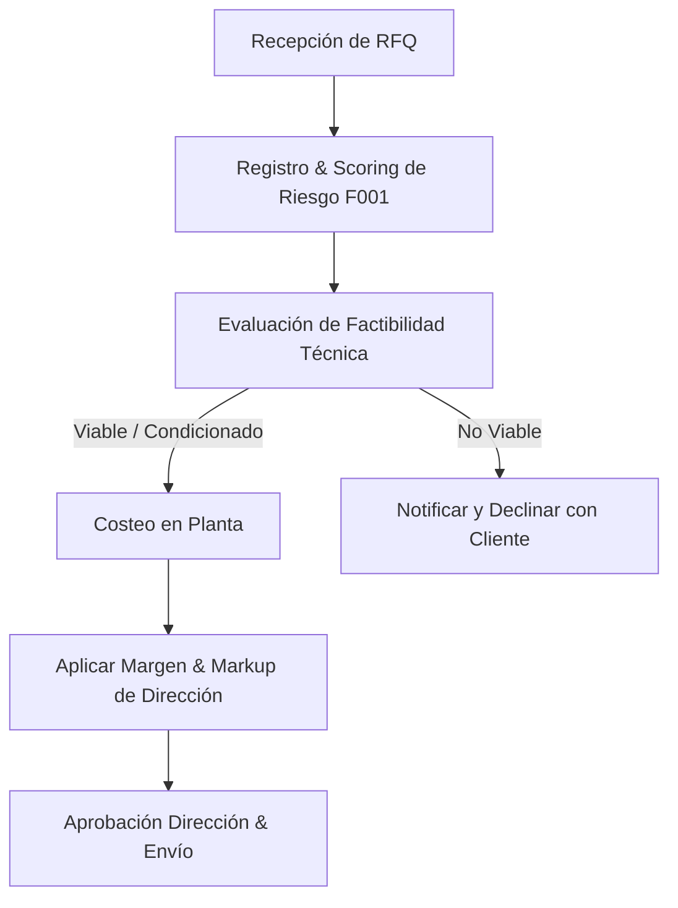

# Datos de Cotización Reales de McVill 🚀

Este documento consolida la estructura matemática, operativa y de ingeniería extraída directamente de los archivos de cotización reales de **McVill S.A. de C.V.** 

Sirve como especificación técnica y de negocio para la calibración del **Cotizador Express**, **Cotizador Avanzado** e **Ingeniería de Factibilidad con IA** dentro del ERP `erp-metalmecanica`.

---

## 📊 1. Flujo de Trabajo y Decisiones de Cotización

El proceso comercial de McVill sigue un flujo jerárquico que va desde la recepción del requerimiento hasta la liberación por parte de Dirección General:

### Clasificación de Riesgo F001 (Matriz de Entrada):
La calculadora de riesgo evalúa el nivel de complejidad del proyecto asignando puntajes según el archivo `SOLICITUD DE RFQ PM_F001.xlsx`:

| Criterio / Factor | 1 Punto | 2 Puntos | 3 Puntos |
| :--- | :---: | :---: | :---: |
| **Aceros únicos requeridos** | $\le 2$ aceros | — | $> 2$ aceros |
| **Procesos distintos de planta** | $< 3$ procesos | 3 a 5 procesos | $\ge 6$ procesos |
| **Sub-ensambles mecánicos** | $\le 2$ sub-ensambles | 3 sub-ensambles | $\ge 4$ sub-ensambles |
| **Hardwares / Comprados** | $\le 2$ hardwares | 3 hardwares | $\ge 4$ hardwares |

*   🟢 **Riesgo LOW (Score 4–5):** SLA de respuesta de **5 días hábiles**.
*   🟡 **Riesgo MEDIO (Score 6–8):** SLA de respuesta de **10 días hábiles**.
*   🔴 **Riesgo HIGH (Score 9–12):** SLA de respuesta de **20 días hábiles**.

---

## 🛠️ 2. Algoritmo de Costeo Físico de Acero y Nesting

En la fabricación de piezas a partir de planchas o placas de acero, McVill realiza un **nesting** (distribución de piezas en una chapa) y calcula el costo real considerando merma por esqueleto y recuperación de chatarra (Scrap Recovery).

### A. Fórmulas de Masa y Dimensionamiento de Placa
1. **Peso Teórico de Placa Completa ($W_T$):**
   $$W_T \text{ (kg)} = 7.85 \times \text{Espesor (mm)} \times \text{Ancho (m)} \times \text{Largo (m)}$$
   *Nota: $7.85$ es la constante de densidad física del acero en $\text{g/cm}^3$ adaptada a dimensiones del sistema métrico.*

2. **Peso Real de Placa con Holgura de Laminación ($W_R$):**
   McVill compensa la tolerancia de espesor y el peso excedente aplicando un factor del 3% (divisor $0.97$):
   $$W_R \text{ (kg)} = \frac{W_T}{0.97}$$

3. **Masa por Metro Cuadrado ($\text{Kg/m}^2$):**
   $$\text{Kg/m}^2 = \frac{W_R}{\text{Ancho (m)} \times \text{Largo (m)}}$$

### B. Asignación de Costos por Componente
1. **Peso Bruto por Pieza (Raw Weight - RW):**
   El peso bruto cobrado distribuye la placa completa entre el número de piezas acomodadas en el nesting ($S$):
   $$RW \text{ (kg)} = \frac{W_R}{S}$$

2. **Peso Neto de Pieza Terminada (Finished Weight - FW):**
   El peso final real de la pieza terminada en base a su área neta de corte ($A$ en $\text{m}^2$):
   $$FW \text{ (kg)} = A \text{ (m}^2) \times \text{Kg/m}^2$$

3. **Eficiencia de Nesting (Porcentaje de Aprovechamiento):**
   $$\% \text{ Utilización} = \frac{FW}{RW}$$

> [!IMPORTANT]
> ### ♻️ Fórmula de Recuperación de Merma (Scrap Recovery)
> McVill reduce el costo final del material cobrado al cliente acreditando el valor del acero sobrante que se recupera y vende como chatarra al taller:
> $$\text{Merma Recuperable (kg)} = RW - FW$$
> $$\text{Scrap Recovery (USD)} = (RW - FW) \times (\text{Tarifa Scrap USD/kg} \times 0.5)$$
> **Costo Neto Final del Acero de la Pieza:**
> $$\text{Costo Neto Acero} = (RW \times \text{Tarifa Acero USD/kg}) - \text{Scrap Recovery}$$

---

## ⏱️ 3. Tiempos de Proceso y Tarifas Reales de McVill

El costo de transformación en planta se calcula multiplicando las horas de operación de cada máquina o puesto de trabajo por su tarifa horaria real. La auditoría reveló las siguientes 13 estaciones:

| Estación / Operación | Unidad | Tarifa (USD) | Lógica de Cálculo de Tiempos |
| :--- | :---: | :---: | :--- |
| **Laser (Corte Láser)** | Hora | **$125.00** | $\text{Horas} = \frac{\text{Perímetro de corte (pulgadas)} / \text{Velocidad de corte (pulgadas/min)}}{60}$ |
| **Oxicorte / Plasma** | Hora | **$75.00** | Horas cargadas por espesor grueso. |
| **Rebabeo (Deburring)** | Hora | **$25.00** | Tiempo manual de limpieza de rebabas y escoria. |
| **Doblez (Bending CNC)** | Hora | **$45.00** | Configuración de prensa y número de golpes en dobladora. |
| **Rolado (Rolling)** | Hora | **$45.00** | Tiempo de rolado de perfiles o planchas. |
| **Biselado (Beveling)** | Hora | **$35.00** | Preparación de chaflán angular previo a soldadura. |
| **Enderezado** | Hora | **$30.00** | Corrección de flexión por calor post-soldadura. |
| **Sierra - Cinta** | Hora | **$35.00** | Corte de perfiles estructurales, vigas y tubos. |
| **Punching / Stamping** | Hora | **$45.00** | Punzonado mecánico de barrenos pequeños. |
| **Marcado** | Hora | **$125.00** | Grabado láser de número de parte o código de trazabilidad. |
| **Maquinado CNC** | Hora | **$55.00** | Tornos y centros de maquinado Mazak. |
| **Ensamble y Soldadura** | Hora | **$35.00** | *Fórmula de pases de soldadura por leg size* (ver abajo). |
| **Pintura Industrial** | **$\text{m}^2$** | **$40.00** | **¡Nota crítica!** Se cobra por metro cuadrado de área expuesta, no por hora. |

---

### ⚡ La Fórmula de Soldadura por Pases (Conversión Leg-Size)
En la hoja de costos de soldadura, Ingeniería de McVill utiliza una fórmula especializada para multiplicar los pases de soldadura según el espesor o tamaño de cateto del cordón requerido (columna `leg size` en mm):

*   **Espesor cateto $< 6\text{ mm}$ (1/4"):** 1 pase (Multiplicador = 1)
*   **Espesor cateto $\ge 6\text{ mm}$ y $< 12\text{ mm}$ (1/2"):** 2 pases (Multiplicador = 2)
*   **Espesor cateto $\ge 12\text{ mm}$ y $< 19\text{ mm}$ (3/4"):** 3 pases (Multiplicador = 3)
*   **Espesor cateto $\ge 19\text{ mm}$:** 4 pases (Multiplicador = 4)

**Cálculo de Tiempos de Soldadura:**
$$\text{Pulgadas Totales con Pases} = \text{Largo Soldadura (pulgadas)} \times \text{Multiplicador de Pases} \times \text{Piezas}$$
$$\text{Tiempo de Arco (min)} = \frac{\text{Pulgadas Totales con Pases}}{\text{Velocidad Soldadura (5 in/min)}}$$
$$\text{Tiempo Total de Operación} = \text{Tiempo de Arco} + (\text{Tiempo de Armado/Tack} \times \text{Piezas})$$

---

## 📈 4. Markup de Precio de Venta (Margen sobre Precio)

McVill calcula el precio de venta unitario ($P.U.$) utilizando un **markup de margen sobre precio de venta**, no sobre costo, garantizando la rentabilidad exacta requerida por la Dirección Financiera:

$$\text{Costo Directo} = \text{Costo Neto Acero} + \text{Subtotal de Procesos (Horas } \times \text{ Tarifa)}$$
$$\text{Valor Agregado Total (VAT)} = \text{Costo Directo} + \text{Flete} + \text{Embalaje} + \text{Calidad (5\% de Procesos)}$$
$$P.U. = \frac{\text{Costo Neto Acero} + \text{VAT}}{1 - \text{Margen de Utilidad \%}}$$

*   *Ejemplo de Calibración:* Si el costo acumulado de materiales y transformación es de $150 USD y se establece un margen de utilidad del 18% para el proyecto:
    $$P.U. = \frac{150}{1 - 0.18} = \frac{150}{0.82} = \$182.92 \text{ USD}$$
    *La utilidad neta es exactamente el 18% del precio cobrado al cliente:* $\$182.92 \times 0.18 = \$32.92 \text{ USD}$.

---

## 📐 5. Checklist de Ingeniería y Factibilidad de Procesos

Para la aprobación técnica del RFQ en el módulo de factibilidad, Ingeniería evalúa cada uno de los 15 procesos bajo tres dimensiones críticas en escala del **0 al 2**:

1.  **Disponibilidad de Máquina:** 0 = No disponible, 1 = Capacidad ajustada, 2 = Disponible al 100%.
2.  **Herramental / Dados:** 0 = No se tiene, 1 = Requiere diseño/fabricación, 2 = Herramental listo.
3.  **Capacidad Humana / Calificación:** 0 = Sin personal calificado, 1 = Capacidad media, 2 = Alta capacidad.

### Criterios de Veredicto Global:
*   🟢 **VIABLE (Score 6):** El proceso está listo para cotizarse y programarse de inmediato.
*   🟡 **CONDICIONADO (Score 5):** Requiere un **Plan de Mitigación obligatorio** detallado en la propuesta comercial:
    *   *Falla en Doblez (Herramental)* $\rightarrow$ **"FABRICAR DADOS A DIMENSION DE LAS PIEZAS"**
    *   *Falla en Armado/Ensamble (Fixtures)* $\rightarrow$ **"FABRICAR PLANTILLAS PARA ARMADO"**
    *   *Falla en Soldadura (Normativa)* $\rightarrow$ **"CALIFICAR SOLDADURA BAJO AWS D1.1/D1.3 CON PERSONAL CALIFICADO"**
*   🔴 **NO VIABLE (Score $\le 4$):** Excede la capacidad técnica de planta McVill. Se declina la partida del RFQ.

---
*Especificación técnica generada bajo el estándar **Agus Pro** para la integración de módulos en erp-metalmecanica.*
